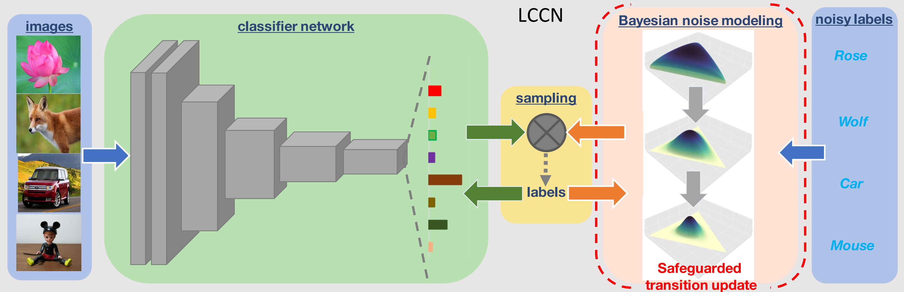

# Latent Class-Conditional Noise Model

<div align="left">
  
</div>

## Abstract 
Learning with noisy labels has become imperative in the Big Data era, which saves expensive human labors on accurate annotations. Previous noise-transition-based methods have achieved theoretically-grounded performance under the Class-Conditional Noise model (CCN). However, these approaches builds upon an ideal but impractical anchor set available to pre-estimate the noise transition. Even though subsequent works adapt the estimation as a neural layer, the ill-posed stochastic learning of its parameters in back-propagation easily falls into undesired local minimums. We solve this problem by introducing a Latent Class-Conditional Noise model (LCCN) to
parameterize the noise transition under a Bayesian framework. By projecting the noise transition into the Dirichlet space, the learning is constrained on a simplex characterized by the complete dataset, instead of some ad-hoc parametric space wrapped by the neural layer. We then deduce a dynamic label regression method for LCCN, whose Gibbs sampler allows us efficiently infer the latent true labels to train the classifier and to model the noise. Our approach safeguards the stable update of the noise transition, which avoids previous arbitrarily tuning from a mini-batch of samples. We further generalize LCCN to different counterparts compatible with open-set noisy labels, semi-supervised learning as well as cross-model training. A range of experiments demonstrate the advantages of LCCN and its variants over the current state-of-the-art methods. 

## Get Started

The implementation of LCCN can be found in [LCCN](https://github.com/Sunarker/Safeguarded-Dynamic-Label-Regression-for-Noisy-Supervision).


- Form the noisy datasets.
```Shell
  python dataset.py
  ```

- Train DNNs directly with the cross-entropy loss (CE).
```Shell
  python cifar10_train.py --train_dir results/events_ce/cifar10_train --noise_rate 0.3 # You can train other models like this one
  ```

- Train Bootstrapping
```Shell
  python cifar10_train_bootstrapping.py --train_dir results/events_bootstrapping/cifar10_train --noise_rate 0.3 # You can train other models like this one
  ```

- Train Forward 
```Shell
  python cifar10_train_T.py --init_dir results/events_ce/cifar10_train --train_dir results/events_T/cifar10_train --noise_rate 0.3 # You can train other models like this one
  ```
  
- Train S-adaptation
```Shell
  python cifar10_train_varT.py --init_dir results/events_ce/cifar10_train --train_dir results/events_varT/cifar10_train --noise_rate 0.3 # You can train other models like this one
  ```
  
- Train LCCN
```Shell
  python cifar10_train_varC.py --init_dir results/events_ce/cifar10_train --train_dir results/events_varC/cifar10_train --noise_rate 0.3 # You can train other models like this one
```


To train DivideLCCN on CIFAR-10/CIFAR-100 with different noisy types/ratios, simply run:

- Train DivideLCCN, sym noise, CIFAR-10
```Shell
  python divide_train_varC.py --noise_mode sym --r 0.2 --dataset cifar10 --num_class 10 --data_dir ${data_dir} # You can train other models like this one
```

- Train DivideLCCN, asym noise, CIFAR-10
```Shell
  python divide_train_varC.py --noise_mode asym --r 0.1 --dataset cifar10 --num_class 10 --data_dir ${data_dir} # You can train other models like this one
```

- Train DivideLCCN, sym noise, CIFAR-100
```Shell
  python divide_train_varC.py --noise_mode sym --r 0.2 --dataset cifar100 --num_class 100 --data_dir ${data_dir} # You can train other models like this one
```

- Train DivideLCCN, asym noise, CIFAR-100
```Shell
  python divide_train_varC.py --noise_mode asym --r 0.1 --dataset cifar100 --num_class 100 --data_dir ${data_dir} # You can train other models like this one
```


**Citation
```
@article{yao2023latent,
  title={Latent Class-Conditional Noise Model},
  author={Yao, Jiangchao and Han, Bo and Zhou, Zhihan and Zhang, Ya and Tsang, Ivor W},
  journal={IEEE Transactions on Pattern Analysis and Machine Intelligence},
  year={2023},
  publisher={IEEE}
}
```


## Acknowledgement

We borrow some codes from [LCCN](https://github.com/Sunarker/Safeguarded-Dynamic-Label-Regression-for-Noisy-Supervision) and [DivideMix](https://github.com/LiJunnan1992/DivideMix).


